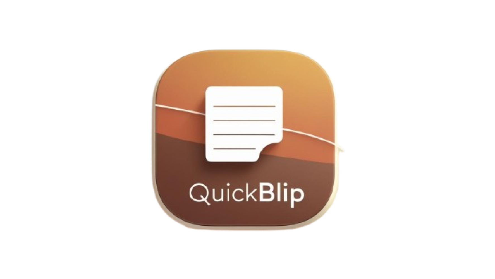

<div align="center">
  
</div>

# QuickBlip

**QuickBlip** is a lightweight, real-time note-taking application designed for speed, simplicity, and a distraction-free writing experience.

## 🚀 Features

- **Real-Time Sync:** Note updates are synced instantly across your devices.
- **Authentication:** Secure email and password sign-up/login.
- **Minimalist Editor:** A clean interface that helps you focus on writing.
- **Dark Mode:** Built-in toggle for comfortable reading and writing at night.
- **Quick Search:** Instantly filter your notes by title or content on the dashboard.

## 🛠️ Tech Stack

- **Framework:** [Next.js](https://nextjs.org/) (App Router)
- **UI & Components:** [React](https://reactjs.org/) & [TypeScript](https://www.typescriptlang.org/)
- **Styling:** CSS Modules
- **Backend & Database:** [Firebase](https://firebase.google.com/) (Auth & Firestore)

## 📁 Project Structure

```text
QuickBlip/
├── public/
│   ├── file.svg
│   ├── globe.svg
│   ├── logo-dark.png
│   ├── logo1.png
│   ├── next.svg
│   ├── vercel.svg
│   └── window.svg
├── src/
│   ├── app/
│   │   ├── dashboard/
│   │   │   ├── dashboard.module.css
│   │   │   └── page.tsx
│   │   ├── editor/
│   │   │   └── [id]/
│   │   │       ├── editor.module.css
│   │   │       └── page.tsx
│   │   ├── login/
│   │   │   ├── login.module.css
│   │   │   └── page.tsx
│   │   ├── signup/
│   │   │   ├── page.tsx
│   │   │   └── signup.module.css
│   │   ├── favicon.ico
│   │   ├── globals.css
│   │   ├── layout.tsx
│   │   ├── page.module.css
│   │   └── page.tsx
│   ├── context/
│   │   └── AuthContext.tsx
│   └── lib/
│       └── firebase.ts
├── .env.example
├── .env.local
├── .gitignore
├── eslint.config.mjs
├── LICENSE
├── next-env.d.ts
├── next.config.ts
├── package-lock.json
├── package.json
├── README.md
└── tsconfig.json
```

## 🚦 Getting Started

1. **Install dependencies:**
   ```bash
   npm install
   ```

2. **Set up Firebase:**
   Copy `.env.example` to `.env.local` and populate it with your Firebase project configuration credentials.

3. **Run the development server:**
   ```bash
   npm run dev
   ```

Open [http://localhost:3000](http://localhost:3000) in your browser to start writing notes.
